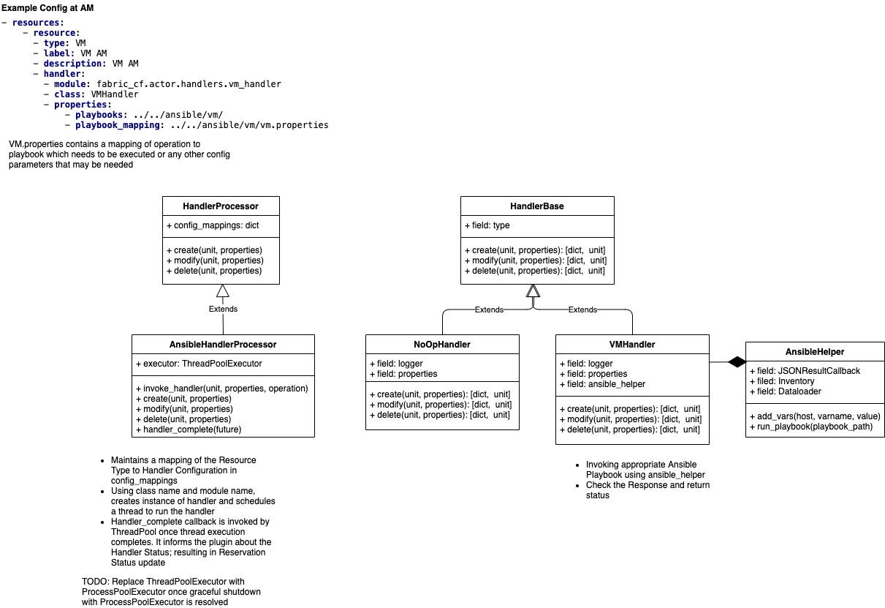

[](https://requires.io/github/fabric-testbed/AMHandlers/requirements/?branch=main)

[](https://pypi.org/project/fabric-am-handlers/)

# AMHandlers
## Aggregate Manager
An aggregate manager controls access to the substrate components. It controls some set of infrastructure resources in a particular site consisting of a set of servers, storage units, network elements or other components under common ownership and control. AMs inform brokers about available resources by passing to the resource advertisement information models. AMs may be associated with more than one broker and the partitioning of resources between brokers is the decision left to the AM. Oversubscription is possible, depending on the deployment needs.
FABRIC enables a substrate provider to outsource resource arbitration and calendar scheduling to a broker. By delegating resources to the broker, the AM consents to the broker’s policies, and agrees to try to honor reservations issued by the broker if the user has authorization on the AM. 

Besides common code, each AM type has resource-specific modules that determine its resource allocation behavior (Resource Management Policy) and the specific actions it takes to provision a sliver (Resource Handler). Both plugins are invoked by AM common core code based on the resource type or type of request being considered. 

## Handlers
The AM upcalls a handler interface to setup and teardown each sliver. Resource handlers perform any substrate-specific configuration actions needed to implement slivers. The handler interface includes a probe method to poll the current status of a sliver, and modify to adjust attributes of a sliver. 

Handlers are registered and selected by resource type. Each handler invocation executes in an independent thread, so handlers may block for slow configuration actions. Handlers are invoked through a class called HandlerProcessor, which can invoke an interpreter for a handler scripting language. The handlers will be written in the Python scripting language. 

Each handler implements 3 basic operation types for a resource:
- Create - provision a resource
  - Example - create a VM or a bare-metal node, or a network connection
- Delete - un-provision a resource
  - Undo the create above
- Modify - modify the state of a resource
  - Modify a property of the VM, or a network connection (e.g. change bandwidth)
  
Each operation can have subcommands and parameters that determine the details of the actions taken, some of which are discussed below. These parameters help ‘stitch’ multiple slivers together. A canonical example is the passing of network information from the handler provisioning the network to the handler provisioning a compute node so that the compute node ends up with correct network configuration (e.g. attached to a correct VLAN). Specific parameters for operations are a matter of convention between the resource management policy and the plugin. 

Handlers receive the parameters as part of the provisioning workflow (sequence of redeem operations) executed by the Orchestrator on the AMs. They can also pass information back to the Orchestrator about reserved resources as part of the standard exchange of messages between AM and Orchestrator during the provisioning.

## Playbooks
Handlers use Ansible Playbooks for provisioning.  

## Interface and design


## Configuration
AM Handlers require following configuration to be setup:
- [Inventory](./fabric_am/playbooks/inventory) information for the headnode 
- Handler config file (VM Handler example depicted below)
### VM Handler Config File
VM Handler config file can be found `fabric_am/config/vm_handler_config.yml`. 
It describes the Playbook location and names for specific operations. 
```
playbooks:
  location: /etc/fabric/actor/playbooks
  inventory_location: /etc/fabric/actor/playbooks/inventory
  hostname_suffix: .fabric-testbed.net
  VM: head_vm_provisioning.yml
  GPU: worker_pci_provisioning.yml
  SmartNIC: worker_pci_provisioning.yml
  SharedNIC: worker_pci_provisioning.yml
  FPGA: worker_pci_provisioning.yml
  NVME: worker_pci_provisioning.yml
```

